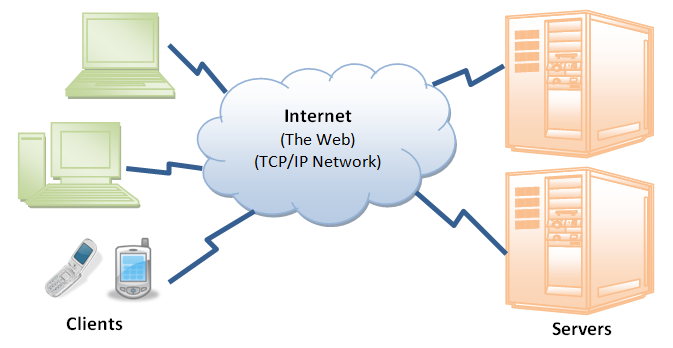
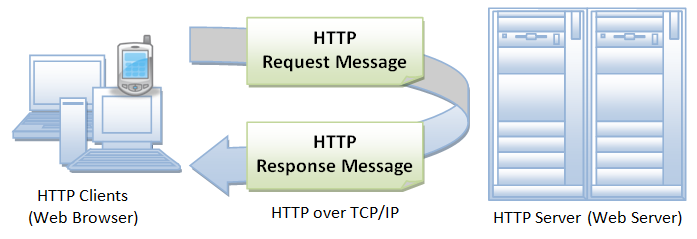

# HTTP基础
> ***HTTP (HyperText Transfer Protocol) Basics***

> 本文翻译自[HTTP Basic](https://www.ntu.edu.sg/home/ehchua/programming/webprogramming/HTTP_Basics.html)

## 简介
> ***Introduction***
---

### 万维网
> ***WEB***
因特网（或者万维网）是一个复杂的分布式客户端/服务端信息系统，如下图所示。
> Internet (or The Web) is a massive distributed client/server information system as depicted in the following diagram.



在万维网上有很多应用在同时运行着，比如web浏览/冲浪，电子邮件，文件传输，音视频流等等，为了在客户端和服务端产生正常通信，这些应用必须协定一种特殊的应用层协议，例如HTTP，FTP，SMTP，POP等等。
> Many applications are running concurrently over the Web, such as web browsing/surfing, e-mail, file transfer, audio & video streaming, and so on.  In order for proper communication to take place between the client and the server, these applications must agree on a specific application-level protocol such as HTTP, FTP, SMTP, POP, and etc.

### 超文本传输协议（HTTP）
> ***HyperText Transfer Protocol (HTTP)***

HTTP(超文本传输协议）也许是因特网中使用最广泛的应用协议。
> HTTP (Hypertext Transfer Protocol) is perhaps the most popular application protocol used in the Internet (or The WEB).

* 如图所示，HTTP是非对称请求-响应客户端-服务端协议。HTTP客户端发送请求消息到HTTP服务端。反过来，服务端会返回一个响应消息。换言之，HTTP是一种拉取协议，客户端从服务端拉取消息（而不是服务端推送消息客户端）。
> * HTTP is an asymmetric request-response client-server protocol as illustrated.  An HTTP client sends a request message to an HTTP server.  The server, in turn, returns a response message.  In other words, HTTP is a pull protocol, the client pulls information from the server (instead of server pushes information down to the client).



* HTTP是无状态协议。换言之，本次请求并不知道上次请求做了什么。
> * HTTP is a stateless protocol. In other words, the current request does not know what has been done in the previous requests.
* HTTP允许对数据类型和表示进行协定，以允许系统独立于数据传输而构建。
> * HTTP permits negotiating of data type and representation, so as to allow systems to be built independently of the data being transferred.
* 引用自RFC2616：“超文本传输​​协议（HTTP）是用于分布式协作的超媒体信息系统的应用层协议，它是一种通用的无状态协议，可以通过扩展其请求方法，错误码和请求头，用于除超文本之外的许多任务，例如名称服务器和分布式对象管理系统。
> * Quoting from the RFC2616: "The Hypertext Transfer Protocol (HTTP) is an application-level protocol for distributed, collaborative, hypermedia information systems. It is a generic, stateless, protocol which can be used for many tasks beyond its use for hypertext, such as name servers and distributed object management systems, through extension of its request methods, error codes and headers."

### 浏览器
> ***Browser***

每当您从浏览器发出URL以使用HTTP获取Web资源时，例如: http://www.nowhere123.com/index.html， 浏览器将URL转换为请求消息并将其发送到HTTP服务器。HTTP服务器解析你的请求消息，并返回适当的响应消息，该消息是你请求的资源或错误消息。这个过程如下图所示：
> Whenever you issue a URL from your browser to get a web resource using HTTP, e.g. http://www.nowhere123.com/index.html, the browser turns the URL into a request message and sends it to the HTTP server. The HTTP server interprets the request message, and returns you an appropriate response message, which is either the resource you requested or an error message. This process is illustrated below:


### 统一资源定位符（URL）
> ***Uniform Resource Locator (URL)***

URL（统一资源定位符）用于在Web中唯一标识资源。URL具有以下语法：
> A URL (Uniform Resource Locator) is used to uniquely identify a resource over the web. URL has the following syntax:

    protocol://hostname:port/path-and-file-name

URL分为4个部分：
1. 协议：客户端和服务端使用的应用层协议，例如HTTP，FTP和telnet。
2. 主机名：服务器的DNS域名（如www.nowhere123.com）或IP地址（如192.128.1.2）。
3. 端口：服务器监听来自客户端的传入请求的TCP端口号。
4. 路径和文件名：服务器文档基本目录下所请求资源的名称和位置。

> There are 4 parts in a URL:
> 1. Protocol: The application-level protocol used by the client and server, e.g., HTTP, FTP, and telnet.
> 2. Hostname: The DNS domain name (e.g., www.nowhere123.com) or IP address (e.g., 192.128.1.2) of the server.
> 3. Port: The TCP port number that the server is listening for incoming requests from the clients.
> 4. Path-and-file-name: The name and location of the requested resource, under the server document base directory.

举例说明，在URL http://www.nowhere123.com/docs/index.html 中，通信协议是HTTP；主机名是www.nowhere123.com。URL中未指定端口号，采用默认的端口号，即HTTP的TCP端口80。
要定位的资源路径和文件名是“/docs/index.html"。
> For example, in the URL http://www.nowhere123.com/docs/index.html, the communication protocol is HTTP; the hostname is www.nowhere123.com. The port number was not specified in the URL, and takes on the default number, which is TCP port 80 for HTTP. The path and file name for the resource to be located is "/docs/index.html".

URL的其他例子如下：
> Other examples of URL are:
```
ftp://www.ftp.org/docs/test.txt
mailto:user@test101.com
news:soc.culture.Singapore
telnet://www.nowhere123.com/
```

### HTTP协议
> ***HTTP Protocol***

如上所述，每当你在浏览器地址栏中输入URL时，浏览器就会根据指定的协议将URL转换为请求消息，并将请求消息发送到服务器。例如，浏览器将URL http://www.nowhere123.com/doc/index.html
转换为以下请求消息：
> As mentioned, whenever you enter a URL in the address box of the browser, the browser translates the URL into a request message according to the specified protocol; and sends the request message to the server.For example, the browser translated the URL http://www.nowhere123.com/doc/index.html into the following request message:

```
GET /docs/index.html HTTP/1.1
Host: www.nowhere123.com
Accept: image/gif, image/jpeg, */*
Accept-Language: en-us
Accept-Encoding: gzip, deflate
User-Agent: Mozilla/4.0 (compatible; MSIE 6.0; Windows NT 5.1)
(blank line)
```

当此请求消息到达服务器时，服务器可以执行以下任一操作：
1. 服务器解释收到的请求，将请求映射到服务器文档目录下的文件中，并将请求的文件返回给客户端。
2. 服务器解释收到的请求，将请求映射到保存在服务器中的程序，执行程序，并将程序的输出返回给客户端。
3. 请求无法满足，服务器返回错误消息。
> When this request message reaches the server, the server can take either one of these actions:
>1. The server interprets the request received, maps the request into a file under the server's document directory, and returns the file requested to the client.
>2. The server interprets the request received, maps the request into a program kept in the server, executes the program, and returns the output of the program to the client.
>3. The request cannot be satisfied, the server returns an error message.

HTTP响应消息的示例如下所示：
> An example of the HTTP response message is as shown:

```
HTTP/1.1 200 OK
Date: Sun, 18 Oct 2009 08:56:53 GMT
Server: Apache/2.2.14 (Win32)
Last-Modified: Sat, 20 Nov 2004 07:16:26 GMT
ETag: "10000000565a5-2c-3e94b66c2e680"
Accept-Ranges: bytes
Content-Length: 44
Connection: close
Content-Type: text/html
X-Pad: avoid browser bug
  
<html><body><h1>It works!</h1></body></html>
```

浏览器接收响应消息，解释消息并根据响应的媒体类型在浏览器窗口中显示消息的内容（如Content-Type响应头中所示）。常见媒体类型包括"text/plain", "text/html", "image/gif", "image/jpeg", "audio/mpeg", "video/mpeg", "application/msword", and "application/pdf"。
> The browser receives the response message, interprets the message and displays the contents of the message on the browser's window according to the media type of the response (as in the Content-Type response header). Common media type include "text/plain", "text/html", "image/gif", "image/jpeg", "audio/mpeg", "video/mpeg", "application/msword", and "application/pdf".

在其空闲状态下，HTTP服务器除了监听配置中为进入请求指定的IP地址和端口外什么都不做。当请求到达时，服务器会分析请求头，应用配置中指定的规则，并采取相应的操作。网站管理员主要是通过配置控制Web服务器行为，将在后面的部分中详细介绍。
> In its idling state, an HTTP server does nothing but listening to the IP address(es) and port(s) specified in the configuration for incoming request. When a request arrives, the server analyzes the message header, applies rules specified in the configuration, and takes the appropriate action. The webmaster's main control over the action of web server is via the configuration, which will be dealt with in greater details in the later sections.

### HTTP与TCP/IP
> ***HTTP over TCP/IP***

HTTP是客户端-服务器应用层协议，它通常在TCP/IP连接上运行，如图所示。（HTTP不必须在TCP/IP连接上运行。它只假设可靠的传输，可以使用任何提供此类保证的传输协议。）
> HTTP is a client-server application-level protocol. It typically runs over a TCP/IP connection, as illustrated. (HTTP needs not run on TCP/IP. It only presumes a reliable transport. Any transport protocols that provide such guarantees can be used.)


TCP/IP(传输控制协议/因特网互联协议)是一组传输层和网络层协议，用于机器通过网络相互通信。
> TCP/IP (Transmission Control Protocol/Internet Protocol) is a set of transport and network-layer protocols for machines to communicate with each other over the network.

IP（因特网互联协议）是网络层协议，处理网络寻址和路由。在IP网络中，每台机器分配唯一的IP地址（例如165.1.2.3），并且IP软件负责将消息从源IP路由到目标IP。在IPV4（IP版本4）中，IP地址由4个字节组成，每个字节的范围为0到255，由点分割，称为四点形式。此编号方案支持网络上最多4G地址。最新的IPv6（IP版本6）支持更多地址。由于记忆数字对于大多数人来说是困难的，因此使用类似英语的域名，例如www.nowhere123.com。DNS（域名服务）将域名转换为IP地址（通过分布式查找表）。特殊IP地址127.0.0.1始终指您自己的计算机。它的domian名称是“localhost”，可用于本地环回测试。
> IP (Internet Protocol) is a network-layer protocol, deals with network addressing and routing. In an IP network, each machine is assigned an unique IP address (e.g., 165.1.2.3), and the IP software is responsible for routing a message from the source IP to the destination IP. In IPv4 (IP version 4), the IP address consists of 4 bytes, each ranges from 0 to 255, separated by dots, which is called a quad-dotted form.  This numbering scheme supports up to 4G addresses on the network.  The latest IPv6 (IP version 6) supports more addresses.  Since memorizing number is difficult for most of the people, an english-like domain name, such as www.nowhere123.com is used instead.  The DNS (Domain Name Service) translates the domain name into the IP address (via distributed lookup tables). A special IP address 127.0.0.1 always refers to your own machine.  It's domian name is "localhost" and can be used for local loopback testing.

TCP(传输控制协议)是传输层协议，负责在两台机器之间建立连接。TCP包含由两个协议组成：TCP和UDP（用户数据报文包）。TCP是可靠的，每个数据包都有一个序列号，并且需要确认。如果接受方没有接受到数据包，则重新发送。TCP保证数据包传输。UDP不保证数据包传输，因此不可靠，但是，UDP具有较少的数据开销，可用于可靠性并不重要的视频和音频流等应用。
> TCP (Transmission Control Protocol) is a transport-layer protocol, responsible for establish a connection between two machines. TCP consists of 2 protocols: TCP and UDP (User Datagram Package).  TCP is reliable, each packet has a sequence number, and an acknowledgement is expected.  A packet will be re-transmitted if it is not received by the receiver.  Packet delivery is guaranteed in TCP.  UDP does not guarantee packet delivery, and is therefore not reliable.  However, UDP has less network overhead and can be used for applications such as video and audio streaming, where reliability is not critical.

TCP在IP机器中复用应用程序。对于每台IP机，TCP支持（多路复用）最多65536个端口（或套接字），端口号为0到65535。应用程序（如HTTP或FTP）在特定端口号上运行（或侦听）进入请求。端口0到1023被预先分配给流行的协议，例如，HTTP为80，FTP为21，Telnet为23，SMTP为25，NNTP为119，DNS为53。用户可以使用端口1024及以上。
> TCP multiplexes applications within an IP machine. For each IP machine, TCP supports (multiplexes) up to 65536 ports (or sockets), from port number 0 to 65535.  An application, such as HTTP or FTP, runs (or listens) at a particular port number for incoming requests. Port 0 to 1023 are pre-assigned to popular protocols, e.g., HTTP at 80, FTP at 21, Telnet at 23, SMTP at 25, NNTP at 119, and DNS at 53.  Port 1024 and above are available to the users.

尽管TCP端口80已预先分配给HTTP，但作为默认HTTP端口号，这并不禁止您在其他分配给用户的端口号（1024-65535）（如8000,8080）上运行HTTP服务器，尤其是对于测试服务器。你还可以在同一台计算机上的不同端口号上运行多个HTTP服务器。当客户端发出URL而未明确说明端口号时，例如 http://www.nowhere123.com/docs/index.html， 浏览器将连接到主机www.nowhere123.com的默认端口号80。如果服务器正在侦听端口8000而不是默认端口80时，需要在URL中明确指定端口号，例如 http://www.nowhere123.com:8000/docs/index.html。
> Although TCP port 80 is pre-assigned to HTTP, as the default HTTP port number, this does not prohibit you from running an HTTP server at other user-assigned port number (1024-65535) such as 8000, 8080, especially for test server. You could also run multiple HTTP servers in the same machine on different port numbers. When a client issues a URL without explicitly stating the port number, e.g., http://www.nowhere123.com/docs/index.html, the browser will connect to the default port number 80 of the host www.nowhere123.com. You need to explicitly specify the port number in the URL, e.g. http://www.nowhere123.com:8000/docs/index.html if the server is listening at port 8000 and not the default port 80.

简而言之，要通过TCP/IP进行通信，您需要知道（a）IP地址或主机名，（b）端口号。
> In brief, to communicate over TCP/IP, you need to know (a) IP address or hostname, (b) Port number.

### HTTP规范
> ***HTTP Specifications***

HTTP规范由W3C（World-Wide Web Consortium）维护，可从http://www.w3.org/standards/techs/http获得。目前有两种版本的HTTP，即HTTP/1.0和HTTP/1.1。由Tim Berners-Lee编写的原始版本HTTP/0.9（1991）是一种用于在Internet上传输原始数据的简单协议。HTTP/1.0（1996）（在RFC 1945中定义）通过允许类似MIME的消息改进了协议。HTTP/1.0不解决代理，缓存，持久连接，虚拟主机和范围下载的问题。这些功能在HTTP/1.1（1999）中提供（在RFC 2616中定义）。
> The HTTP specification is maintained by W3C (World-wide Web Consortium) and available at http://www.w3.org/standards/techs/http.  There are currently two versions of HTTP, namely, HTTP/1.0 and HTTP/1.1.  The original version, HTTP/0.9 (1991), written by Tim Berners-Lee, is a simple protocol for transferring raw data across the Internet.  HTTP/1.0 (1996) (defined in RFC 1945), improved the protocol by allowing MIME-like messages.  HTTP/1.0 does not address the issues of proxies, caching, persistent connection, virtual hosts, and range download. These features were provided in HTTP/1.1 (1999) (defined in RFC 2616).

## Apache HTTP Server or Apache Tomcat Server
> ***Apache HTTP Server or Apache Tomcat Server***

研究HTTP协议需要HTTP服务器（例如Apache HTTP Server或Apache Tomcat Server）。
> A HTTP server (such as Apache HTTP Server or Apache Tomcat Server) is needed to study the HTTP protocol.

Apache HTTP服务器是一种流行的工业级生产服务器，由Apache Software Foundation（ASF）@ www.apache.org制作。 ASF是一个开源软件基金会。也就是说，Apache HTTP服务器是免费的，带有源代码。
> Apache HTTP server is a popular industrial-strength production server, produced by Apache Software Foundation (ASF) @ www.apache.org.  ASF is an open-source software foundation.  That is to say, Apache HTTP server is free, with source code.

第一个HTTP服务器由Tim Berners Lee在瑞士日内瓦的CERN（欧洲核研究中心）编写，他也发明了HTML。Apache于1995年初在NCSA（美国国家超级计算应用中心）“httpd 1.3”服务器上构建。Apache这个名字可能因其包含一些原始代码（来自早期的NCSA httpd Web服务器）和一些补丁而得名，或者来自美洲印第安部落的名字。
> The first HTTP server is written by Tim Berners Lee at CERN (European Center for Nuclear Research) at Geneva, Switzerland, who also invented HTML.  Apache was built on NCSA (National Center for Supercomputing Applications, USA) "httpd 1.3" server, in early 1995. Apache probably gets its name from the fact that it consists of some original code (from an earlier NCSA httpd web server) plus some patches; or from the name of an American Indian tribe.

阅读关于如何安装和配置Apache HTTP服务器的“[Apache How-to](https://www.ntu.edu.sg/home/ehchua/programming/howto/Apache_HowToInstall.html, "Apache How-to")”;或“[Tomcat How-to](https://www.ntu.edu.sg/home/ehchua/programming/howto/Tomcat_HowTo.html)”安装和开始使用Apache Tomcat Server。
> Read "Apache How-to" on how to install and configuare Apache HTTP server; or "Tomcat How-to" to install and get started with Apache Tomcat Server.

## HTTP请求和响应消息
> ***HTTP Request and Response Messages***

HTTP客户端和服务端通过发送文本消息进行通信。客户端发送一个请求消息到服务端，反过来，服务器返回响应消息。
> HTTP client and server communicate by sending text messages. The client sends a request message to the server.  The server, in turn, returns a response message.

HTTP消息由消息头和可选消息体组成，由空行分隔，如下所示：
> An HTTP message consists of a message header and an optional message body, separated by a blank line, as illustrated below:


### HTTP请求消息
> ***HTTP Request Message***

HTTP请求消息的格式如下：
> The format of an HTTP request message is as follow:


#### 请求行
> ***Request Line***

头体的第一行称为请求行，后跟可选的请求头。
> The first line of the header is called the request line, followed by optional request headers.

请求行具有以下语法：
> The request line has the following syntax:

    request-method-name request-URI HTTP-version

* request-method-name：HTTP协议定义一组请求方法，例如GET，POST，HEAD和OPTIONS。 客户端可以使用这些方法之一向服务器发送请求。
* request-URI：指定请求的资源。
* HTTP-version：目前正在使用两个版本：HTTP/1.0和HTTP/1.1。
> * request-method-name: HTTP protocol defines a set of request methods, e.g., GET, POST, HEAD, and OPTIONS. The client can use one of these methods to send a request to the server.
> * request-URI: specifies the resource requested.
> * HTTP-version: Two versions are currently in use: HTTP/1.0 and HTTP/1.1.

请求行的示例:
> Examples of request line are:

```
GET /test.html HTTP/1.1
HEAD /query.html HTTP/1.0
POST /index.html HTTP/1.1
```

#### 请求头
> ***Request Headers***

请求头采用name：value对的形式，可以指定以逗号分隔的多个值。
> The request headers are in the form of name:value pairs. Multiple values, separated by commas, can be specified.

    request-header-name: request-header-value1, request-header-value2, ...

请求标头的示例如下:
> Examples of request headers are:

```
Host: www.xyz.com
Connection: Keep-Alive
Accept: image/gif, image/jpeg, */*
Accept-Language: us-en, fr, cn
```

#### 范例
> ***Example***

以下显示了一个示例HTTP请求消息：
> The following shows a sample HTTP request message:


### HTTP响应消息
> ***HTTP Response Message***

HTTP响应消息的格式如下：
> The format of the HTTP response message is as follows:


#### 状态行
> ***Status Line***

第一行称为状态行，后跟可选的响应头。
> The first line is called the status line, followed by optional response header(s).

状态行具有如下格式：
> The status line has the following syntax:

    HTTP-version status-code reason-phrase

* HTTP-version: 此会话中使用的HTTP版本。 HTTP/1.0和HTTP/1.1。
* status-code: 服务器生成的3位数字，用于反映请求的结果。
* reason-phrase: 给出了状态代码的简短说明。
* 常用状态代码和原因短语为“200 OK”，“404 Not Found”，“403 Forbidden”，“500 Internal Server Error”。

> * HTTP-version: The HTTP version used in this session. Either HTTP/1.0 and HTTP/1.1.
> * status-code: a 3-digit number generated by the server to reflect the outcome of the request.
> * reason-phrase: gives a short explanation to the status code.
> * Common status code and reason phrase are "200 OK", "404 Not Found", "403 Forbidden", "500 Internal Server Error".